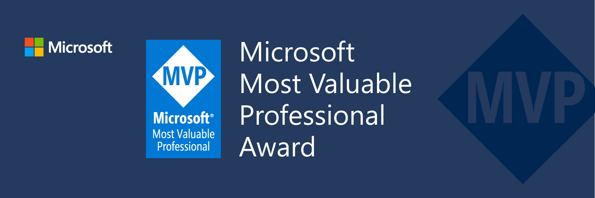

Hi, I'm Vincent Hoogendoorn (aka VincentH.NET). I'm currently working as:
- Independent Tech Lead, Architect & Software Engineer at [InnoWvate.NET](http://InnoWvate.NET)
- Technology Director at [Applicita](https://Applicita.com)

My passion is to improve the .NET developer productivity & experience. 
Current focus: Full stack C# with Microsoft Orleans and/or C# Markup

I'm the author of:
- [Modern.CSharp.Templates](https://github.com/Applicita/Modern.CSharp.Templates) 
  A toolkit of modern dotnet new templates for C# 11, .NET 7, Microsoft Orleans 7, Windows App SDK and Uno Platform
- [Orleans.Multiservice](https://github.com/Applicita/Orleans.Multiservice) 
  Prevent microservices pain with logical service separation in a modular monolith for Microsoft Orleans 7
- [Orleans.Multitenant](https://github.com/Applicita/Orleans.Multitenant) 
  Secure, flexible tenant separation for Microsoft Orleans 7
- [Orleans.Results](https://github.com/Applicita/Orleans.Results) 
  Concise, version-tolerant result pattern implementation for Microsoft Orleans 7
- [C# Markup 2](https://github.com/VincentH-Net/CSharpForMarkup) 
  Build .NET browser / native UI in declarative C#; enjoy a Flutter-like UI development experience with .NET Hot Reload and the main .NET UI frameworks (Windows App SDK, Uno Platform, WPF - coming: Maui, AvaloniaUI, possibly Blazor)
- [Xamarin.CommunityToolkit.Markup](https://www.nuget.org/packages/Xamarin.CommunityToolkit.Markup) (also ported to [CommunityToolkit.Maui.Markup](https://www.nuget.org/packages/CommunityToolkit.Maui.Markup)) 
  A set of fluent helper methods and classes to simplify building declarative Xamarin Forms / .NET MAUI user interfaces in C#. Aka as **C# Markup 1**, which I initially contributed to the Microsoft Xamarin Forms product itself [in version 4.6](https://github.com/VincentH-Net/CSharpForMarkup/tree/csharpformarkup1-archive#csharpformarkup-is-incorporated-in-xamarin-forms-46)

Services I can provide:
- **Microsoft Technology Direction** 
  Define technology strategy, provide tools, practices and guidance to elevate and scale the technological delivery capabilities of software development organizations
- **Cloud Applications** 
  Architect / build / modernize scalable cloud applications with Microsoft Orleans and Azure
- **Frontends** 
  Build / modernize full stack C# .NET applications, for browser / windows / mac / linux / iOS / android

